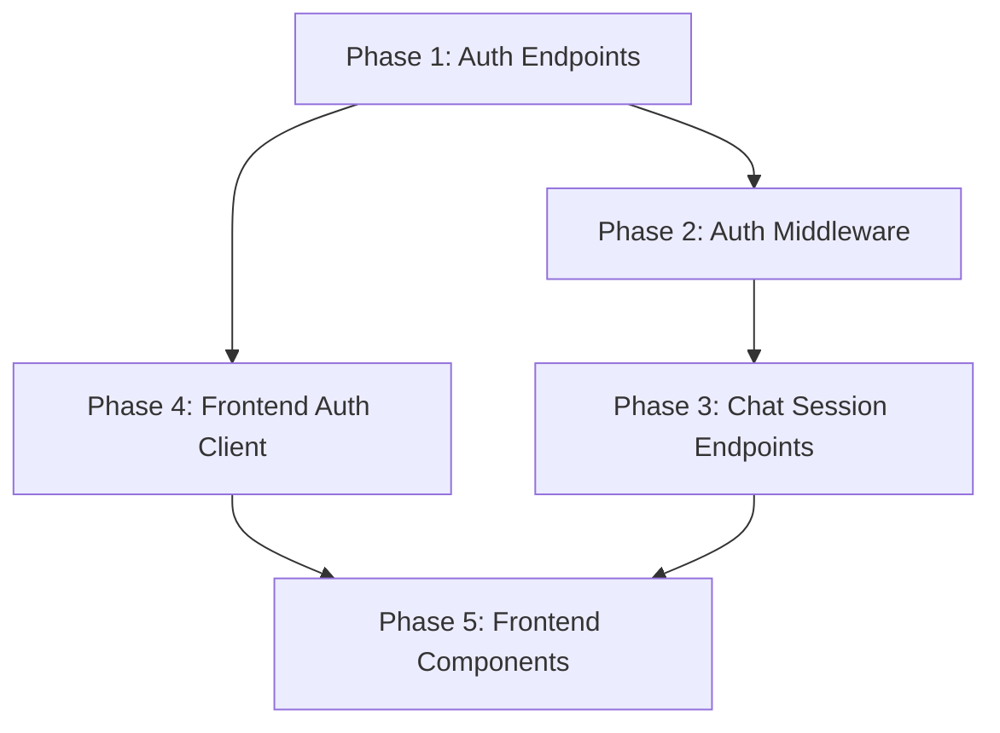

# Implementation Plan: Authenticated Chat with Session Windows

**Branch**: `010-fastapi-auth-chat-windows` | **Date**: 2025-12-21 | **Spec**: [spec.md](./spec.md)
**Input**: Feature specification from `/specs/010-fastapi-auth-chat-windows/spec.md`

## Summary

Migrate authentication from Express.js/Better Auth to FastAPI with JWT/JWKS, add authentication gate to chat, and implement chat session windows (sidebar) for managing multiple conversations. Users must sign in (email/password or Google OAuth) to chat. Each conversation persists as a "session" that users can return to.

**Technical Approach**:
- Use PyJWT with RS256 for stateless JWT authentication
- Expose JWKS endpoint for token verification
- Reuse existing ba_user/ba_account tables from Better Auth
- Add refresh_tokens table for revocation support
- Frontend stores tokens in localStorage with auto-refresh

## Technical Context

**Language/Version**: Python 3.11 (backend), TypeScript 5.0+ (frontend)
**Primary Dependencies**: FastAPI, PyJWT, python-jose, Authlib, bcrypt, SQLModel, React
**Storage**: Neon PostgreSQL (branch: Ary-auth-accounts)
**Testing**: pytest (backend), manual testing (frontend)
**Target Platform**: Web (Docusaurus site + FastAPI backend)
**Project Type**: Web application (frontend + backend)
**Performance Goals**: Sidebar load <500ms, session switch <1s, 100 concurrent users
**Constraints**: Stateless JWT validation, backward compatible with Better Auth users
**Scale/Scope**: Single Docusaurus site, single FastAPI backend, ~10 files modified

## Constitution Check

*GATE: Must pass before Phase 0 research. Re-check after Phase 1 design.*

Verify compliance with Fubuni Docs Agent Constitution:

| Principle | Status | Notes |
|-----------|--------|-------|
| Agent MUST be named "Fubuni" | ✅ PASS | Chat agent remains "Fubuni" |
| OpenAI-compatible providers only | ✅ PASS | Uses OPENROUTER_BASE_URL, no vendor lock |
| Backend in Python 3.11 + OpenAI Agents SDK | ✅ PASS | FastAPI backend, existing agent code unchanged |
| Frontend matches Docusaurus theme | ✅ PASS | Session sidebar uses Docusaurus CSS variables |
| Static deployable, no Node server | ✅ PASS | Auth is API-based, no Node runtime needed |
| No vector DB/crawling/embeddings initially | ✅ PASS | Auth feature, no RAG changes |
| Architecture supports future doc ingestion | ✅ PASS | No architectural changes that block RAG |

**Constitution Check Result**: ✅ ALL PASS - No violations

## Project Structure

### Documentation (this feature)

```text
specs/010-fastapi-auth-chat-windows/
├── spec.md              # Feature specification
├── plan.md              # This file
├── research.md          # Phase 0 research output
├── data-model.md        # Entity definitions
├── quickstart.md        # Development setup guide
├── contracts/           # API contracts
│   ├── auth-api.yaml    # Auth endpoints OpenAPI spec
│   └── chat-sessions-api.yaml  # Chat session endpoints
├── checklists/          # Quality checklists
│   └── requirements.md  # Spec quality checklist
└── tasks.md             # Implementation tasks (created by /sp.tasks)
```

### Source Code (repository root)

```text
backend/
├── app/
│   ├── api/
│   │   ├── auth.py          # NEW: Auth endpoints
│   │   └── chat.py          # MODIFY: Add session management, require auth
│   ├── config/
│   │   ├── keys.py          # NEW: JWT key manager
│   │   ├── settings.py      # MODIFY: Add JWT settings
│   │   └── database.py      # Existing
│   ├── middleware/
│   │   └── auth.py          # MODIFY: Local JWT validation
│   ├── models/
│   │   ├── __init__.py      # Existing chat models
│   │   └── auth.py          # NEW: Auth models
│   └── main.py              # MODIFY: Include auth router
├── requirements.txt         # MODIFY: Add auth dependencies
└── tests/
    └── test_auth.py         # NEW: Auth tests

src/
├── lib/
│   └── auth.ts              # NEW: Auth client
├── components/
│   ├── Auth/
│   │   ├── AuthProvider.tsx # MODIFY: Use new auth client
│   │   └── AuthModal.tsx    # MODIFY: Use new endpoints
│   └── Chat/
│       ├── SessionSidebar.tsx    # NEW: Session list
│       └── SessionSidebar.module.css  # NEW: Sidebar styles
└── pages/
    ├── chat.tsx             # MODIFY: Add sidebar, auth gate
    └── chat.module.css      # MODIFY: Add sidebar layout
```

**Structure Decision**: Web application with existing backend/ and src/ directories. Adding auth to backend, session sidebar to frontend.

## Implementation Phases

### Phase 1: Backend Auth Infrastructure

**Goal**: Create JWT/JWKS authentication system in FastAPI

**Tasks**:
1. Add dependencies to requirements.txt (pyjwt, python-jose, authlib, bcrypt)
2. Create `backend/app/config/keys.py` - RSA key manager
3. Add JWT settings to `backend/app/config/settings.py`
4. Create `backend/app/models/auth.py` - Pydantic models + RefreshToken SQLModel
5. Create `backend/app/api/auth.py` - All auth endpoints
6. Update `backend/app/main.py` - Include auth router

**Deliverables**:
- POST /api/auth/register
- POST /api/auth/login
- POST /api/auth/refresh
- POST /api/auth/logout
- GET /api/auth/me
- GET /api/auth/google
- GET /api/auth/google/callback
- GET /.well-known/jwks.json

### Phase 2: Update Auth Middleware

**Goal**: Replace HTTP-based token validation with local JWT verification

**Tasks**:
1. Update `backend/app/middleware/auth.py` to use PyJWT decode
2. Remove httpx dependency on auth-service
3. Import key_manager and settings for JWT validation
4. Verify issuer, audience, expiry claims

**Deliverables**:
- `verify_token()` uses local JWT validation
- `require_auth` and `get_current_user` work with new tokens
- No HTTP calls to external auth service

### Phase 3: Chat Session Endpoints

**Goal**: Add session management for chat windows

**Tasks**:
1. Add GET /api/chat/sessions - List user's sessions
2. Add POST /api/chat/sessions - Create new session
3. Add GET /api/chat/sessions/{id} - Get session with messages
4. Add DELETE /api/chat/sessions/{id} - Delete session
5. Update POST /api/chat - Require auth, remove anonymous
6. Update POST /api/chat/stream - Require auth

**Deliverables**:
- Session CRUD endpoints working
- User isolation enforced
- Auto-title generation from first message

### Phase 4: Frontend Auth Client

**Goal**: Replace Better Auth client with custom JWT client

**Tasks**:
1. Create `src/lib/auth.ts` - AuthClient class
2. Implement signUp, signIn, signOut, signInWithGoogle methods
3. Implement token storage in localStorage
4. Implement automatic token refresh on 401
5. Create useSession React hook

**Deliverables**:
- AuthClient with all auth methods
- useSession hook for components
- Token refresh working transparently

### Phase 5: Frontend Components

**Goal**: Add auth gate and session sidebar to chat page

**Tasks**:
1. Update `src/components/Auth/AuthProvider.tsx` - Use new client
2. Update `src/components/Auth/AuthModal.tsx` - Use new endpoints
3. Create `src/components/Chat/SessionSidebar.tsx` - Session list
4. Update `src/pages/chat.tsx` - Add sidebar, auth gate
5. Update `src/pages/chat.module.css` - Sidebar layout

**Deliverables**:
- Chat page shows auth modal when not logged in
- Session sidebar displays user's conversations
- Users can create, switch, delete sessions
- Layout adapts for mobile (sidebar collapses)

## Dependencies



## Risk Mitigation

| Risk | Mitigation |
|------|------------|
| Existing users can't login | Use bcrypt (same as Better Auth), test with existing accounts |
| Token refresh race conditions | Implement refresh queue on frontend |
| Google OAuth redirect issues | Test in staging, configure correct URIs |
| Session data loss | Database transactions, test cascade delete |

## Success Metrics

| Metric | Target | How to Verify |
|--------|--------|---------------|
| Registration time | < 2 min | Manual test |
| Sign-in time | < 10 sec | Manual test |
| Sidebar load | < 500ms | Browser DevTools |
| User isolation | 100% | Attempt cross-user access |
| Existing users | Can login | Test with ba_user accounts |

## Artifacts Generated

| File | Type | Description |
|------|------|-------------|
| research.md | Research | Technology decisions and rationale |
| data-model.md | Design | Entity definitions and relationships |
| contracts/auth-api.yaml | Contract | Auth endpoints OpenAPI spec |
| contracts/chat-sessions-api.yaml | Contract | Chat session endpoints OpenAPI spec |
| quickstart.md | Guide | Development setup instructions |

## Next Steps

1. Run `/sp.tasks` to generate implementation task list
2. Implement Phase 1 (Backend Auth Infrastructure)
3. Test auth endpoints with curl/Postman
4. Implement Phase 2-5 sequentially
5. End-to-end testing with existing users
