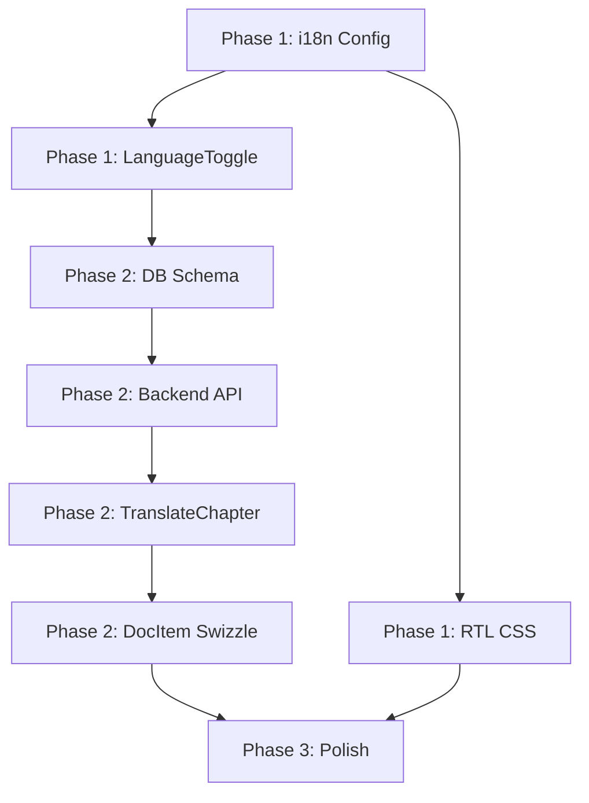

# Implementation Plan: Docusaurus i18n with Floating Toggle & AI Translation

**Branch**: `010-i18n-floating-toggle` | **Date**: 2025-12-17 | **Spec**: [spec.md](./spec.md)
**Input**: Feature specification from `/specs/010-i18n-floating-toggle/spec.md`

## Summary

Add internationalization (i18n) support to the Docusaurus site with English and Urdu languages. Implementation includes:
1. **Floating Language Toggle** - A globe-icon button in the top-left corner (not navbar) that allows users to switch between English and Urdu with proper RTL layout support
2. **AI-Powered Translation** - Logged-in users can translate chapter content to Urdu via a button at the start of each chapter, using an OpenAI-compatible provider
3. **Translation Persistence** - Saved translations are stored in the database for reuse by all users

## Technical Context

**Language/Version**: TypeScript 5.6 (React components), Python 3.11 (FastAPI backend)
**Primary Dependencies**: Docusaurus 3.9.2, React 19, FastAPI, OpenAI SDK (Python)
**Storage**: Neon PostgreSQL (existing `ba_` prefixed tables + new `chapter_translations` table)
**Testing**: Playwright (E2E), Jest (unit)
**Target Platform**: Static site (GitHub Pages) + Backend API (HuggingFace Spaces)
**Project Type**: Web application (Docusaurus frontend + FastAPI backend)
**Performance Goals**: Language switch < 3s, AI translation < 30s for average chapter
**Constraints**: Static deployable frontend, OpenAI-compatible providers only (OPENAI_BASE_URL)
**Scale/Scope**: ~10 documentation chapters, 2 locales (en, ur)

## Constitution Check

*GATE: Must pass before Phase 0 research. Re-check after Phase 1 design.*

Verify compliance with Fubuni Docs Agent Constitution:

| Principle | Status | Notes |
|-----------|--------|-------|
| Agent named "Fubuni" | N/A | Feature doesn't involve agent naming |
| OpenAI-compatible providers only | PASS | AI translation uses OPENAI_BASE_URL per FR-023 |
| Backend in Python 3.11 + OpenAI Agents SDK | PASS | Translation API uses FastAPI + OpenAI SDK |
| Frontend matches Docusaurus theme | PASS | Components use existing CSS variables, glassmorphism |
| Static deployable (no Node server) | PASS | Frontend is static; API calls to separate backend |
| No vector DB/crawling/embeddings | PASS | Simple text translation only |
| Support later documentation ingestion | PASS | Translation storage can serve as future RAG source |

**Post-Design Re-check**: All principles satisfied. No violations.

## Project Structure

### Documentation (this feature)

```text
specs/010-i18n-floating-toggle/
├── plan.md              # This file
├── spec.md              # Feature requirements
├── research.md          # Phase 0 research findings
├── data-model.md        # Entity definitions
├── quickstart.md        # Setup guide
├── contracts/           # API contracts
│   └── api.yaml         # OpenAPI spec for translation endpoints
└── tasks.md             # Implementation tasks (created by /sp.tasks)
```

### Source Code (repository root)

```text
# Frontend (Docusaurus)
src/
├── theme/
│   ├── Root.tsx                      # Existing - add LanguageToggle
│   └── DocItem/
│       └── Content/
│           └── index.tsx             # Swizzled - add TranslateChapter button
├── components/
│   ├── LanguageToggle/               # NEW: Floating language switcher
│   │   ├── index.tsx
│   │   └── styles.module.css
│   └── TranslateChapter/             # NEW: AI translation button
│       ├── index.tsx
│       └── styles.module.css
├── css/
│   ├── custom.css                    # Add RTL-specific styles
│   └── rtl.css                       # NEW: RTL overrides if needed
└── hooks/
    └── useTranslation.ts             # NEW: Translation state management

# i18n folder (Docusaurus convention)
i18n/
└── ur/
    ├── code.json                     # UI string translations
    ├── docusaurus-plugin-content-docs/
    │   └── current/
    │       └── humanoid-robotics-course/
    │           └── *.md              # Placeholder files (empty initially)
    └── docusaurus-theme-classic/
        ├── navbar.json
        └── footer.json

# Backend (FastAPI)
backend/
├── api/
│   ├── translate.py                  # NEW: Translation endpoint
│   └── translations.py               # NEW: CRUD for saved translations
├── models/
│   └── translation.py                # NEW: ChapterTranslation model
└── db/
    └── migrations/
        └── 003_add_translations.sql  # NEW: Database schema

# Configuration
docusaurus.config.ts                  # Update i18n config
```

**Structure Decision**: Web application pattern - Docusaurus frontend with FastAPI backend. Frontend components added via swizzling and custom components. Backend extends existing FastAPI setup from auth feature.

## Complexity Tracking

No constitution violations requiring justification.

## Implementation Phases

### Phase 1: Core i18n Infrastructure

**Goal**: Enable basic language switching without AI translation

1. **Docusaurus i18n Configuration**
   - Update `docusaurus.config.ts` with Urdu locale
   - Create `i18n/ur/` directory structure with placeholder files
   - Verify site builds with both locales

2. **Floating Language Toggle Component**
   - Create `LanguageToggle` component with globe icon
   - Position at top-left (20px, 20px) with glassmorphism styling
   - Implement locale switching via URL navigation
   - Add localStorage persistence for preference

3. **RTL Layout Support**
   - Verify Docusaurus automatic `dir="rtl"` attribute works
   - Add CSS logical properties where needed
   - Test all existing components in RTL mode

### Phase 2: AI Translation Feature

**Goal**: Enable logged-in users to translate chapters

1. **Database Schema**
   - Create `chapter_translations` table migration
   - Add indexes for fast lookup

2. **Backend API Endpoints**
   - `POST /api/translate` - Trigger AI translation
   - `POST /api/translations` - Save translation
   - `GET /api/translations/:chapterId/:locale` - Get saved translation

3. **TranslateChapter Component**
   - Create button component with auth check
   - Show loading state during translation
   - Display translated content with Save button
   - Handle errors with retry option

4. **DocItem Swizzle**
   - Wrap DocItem/Content to inject TranslateChapter button
   - Pass chapter content and ID to component

### Phase 3: Polish & Integration

**Goal**: Complete feature with production readiness

1. **UI Polish**
   - Dark mode support for new components
   - Mobile responsiveness testing
   - Accessibility (ARIA labels, keyboard navigation)

2. **Error Handling**
   - API timeout handling
   - Rate limit messaging
   - Graceful degradation

3. **Testing**
   - E2E tests for language switching
   - E2E tests for translation flow
   - Unit tests for hooks and utilities

## Key Decisions

| Decision | Choice | Rationale |
|----------|--------|-----------|
| Toggle Position | Top-left corner | Avoids collision with chat (bottom-right) and auth (top-right) |
| i18n Approach | Native Docusaurus | Built-in RTL support, URL routing, maintainability |
| Translation Storage | PostgreSQL | Existing infrastructure, persistent across users |
| AI Provider | OpenAI-compatible | Constitution requirement, flexibility with providers |
| Swizzle Strategy | Wrap DocItem/Content | Minimal invasiveness, injects translate button cleanly |

## Dependencies



## Risks & Mitigations

| Risk | Impact | Mitigation |
|------|--------|------------|
| AI translation quality poor for technical content | Medium | Add retry option, allow re-translation |
| RTL breaks existing components | High | Thorough testing, CSS logical properties |
| API rate limits exceeded | Medium | Client-side debouncing, user-friendly error messages |
| Large chapters timeout | Medium | Chunk large content, extend timeout |

## Files to Create/Modify

### New Files
- `src/components/LanguageToggle/index.tsx`
- `src/components/LanguageToggle/styles.module.css`
- `src/components/TranslateChapter/index.tsx`
- `src/components/TranslateChapter/styles.module.css`
- `src/hooks/useTranslation.ts`
- `src/theme/DocItem/Content/index.tsx` (swizzled)
- `i18n/ur/code.json`
- `i18n/ur/docusaurus-theme-classic/navbar.json`
- `i18n/ur/docusaurus-theme-classic/footer.json`
- `backend/api/translate.py`
- `backend/api/translations.py`
- `backend/models/translation.py`
- `backend/db/migrations/003_add_translations.sql`
- `specs/010-i18n-floating-toggle/contracts/api.yaml`

### Modified Files
- `docusaurus.config.ts` - Add i18n configuration
- `src/theme/Root.tsx` - Add LanguageToggle component
- `src/css/custom.css` - Add RTL styles if needed

## Acceptance Criteria Summary

- [ ] Floating toggle visible on all pages (top-left, not navbar)
- [ ] Language switch works in both directions (EN ↔ UR)
- [ ] RTL layout applied correctly when Urdu selected
- [ ] Language preference persists across sessions
- [ ] Translate button visible only to logged-in users
- [ ] AI translation completes within 30 seconds
- [ ] Saved translations available to all users
- [ ] Site builds successfully with empty translation files
- [ ] Mobile-friendly (44x44px tap targets)
